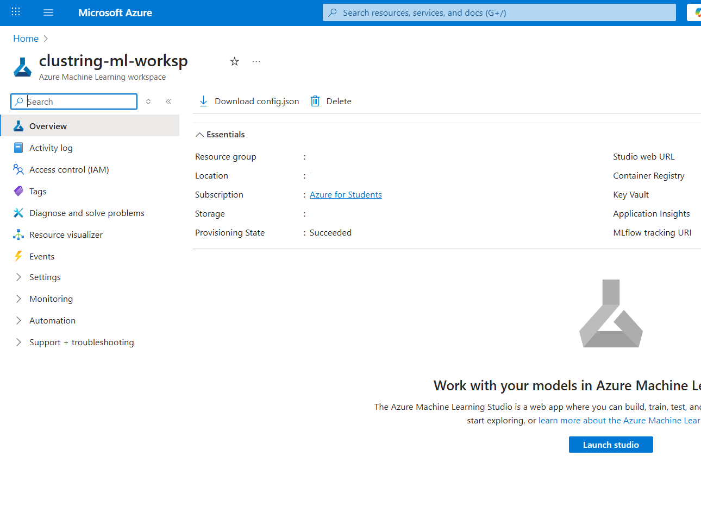
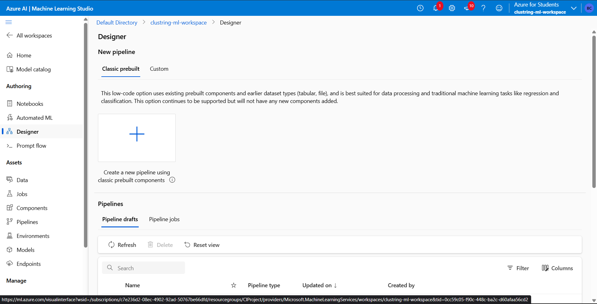
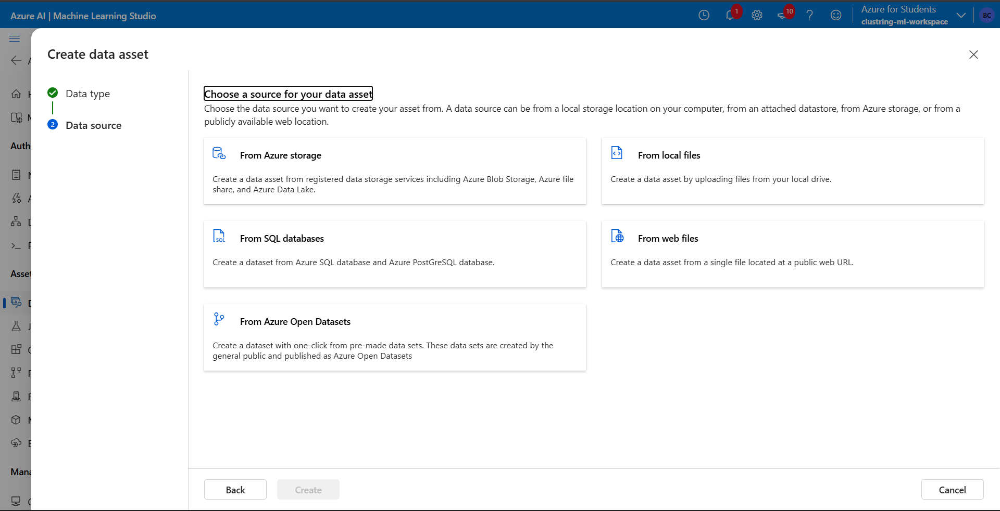

# azure-ml-clustering-model
# Clustering Models with Azure ML Designer

🚀 A comprehensive guide to building clustering models using Azure Machine Learning Designer and deploying the project to GitHub.

## 📋 Table of Contents
- [Project Overview](#project-overview)
- [Prerequisites](#prerequisites)
- [Step-by-Step Implementation](#step-by-step-implementation)
- [Results](#results)
- [GitHub Repository Setup](#github-repository-setup)

## 🎯 Project Overview

This project demonstrates how to create clustering models using Azure ML Designer for customer segmentation and pattern recognition. The solution includes data preprocessing, model training, evaluation, and deployment.

### Key Features
- 📊 Data preprocessing and visualization
- 🔍 K-Means clustering implementation
- 📈 Model evaluation and performance metrics
- ☁️ Azure ML integration and deployment
- 📁 GitHub repository management

## ⚙️ Prerequisites

Before starting, ensure you have:
- [x] Azure subscription
- [x] Azure Machine Learning workspace
- [x] Basic understanding of machine learning concepts

## 🚀 Step-by-Step Implementation

### Step 1: Create Azure ML Workspace



1. Navigate to [Azure Portal](https://portal.azure.com)
2. Search for "Machine Learning"
3. Click "Create"
4. Fill in required details:
   - Subscription
   - Resource group
   - Workspace name
   - Region

### Step 2: Launch Azure ML Designer



1. Open your Azure ML workspace
2. Click on "Designer" in the left sidebar
3. Select "New pipeline"
4. Choose blank template

### Step 3: Import Dataset



1. Click on "Datasets" tab
2. Select "Create dataset"
3. Choose your data source (local file, datastore, etc.)
4. Configure dataset settings
5. Upload your dataset

### Step 4: Data Preprocessing


**Components used:**
- `Select Columns in Dataset`
- `Clean Missing Data`
- `Normalize Data`

```python
# Sample data preprocessing steps
1. Handle missing values
2. Normalize numerical features
3. Select relevant columns
4. Split data (70% training, 30% testing)
